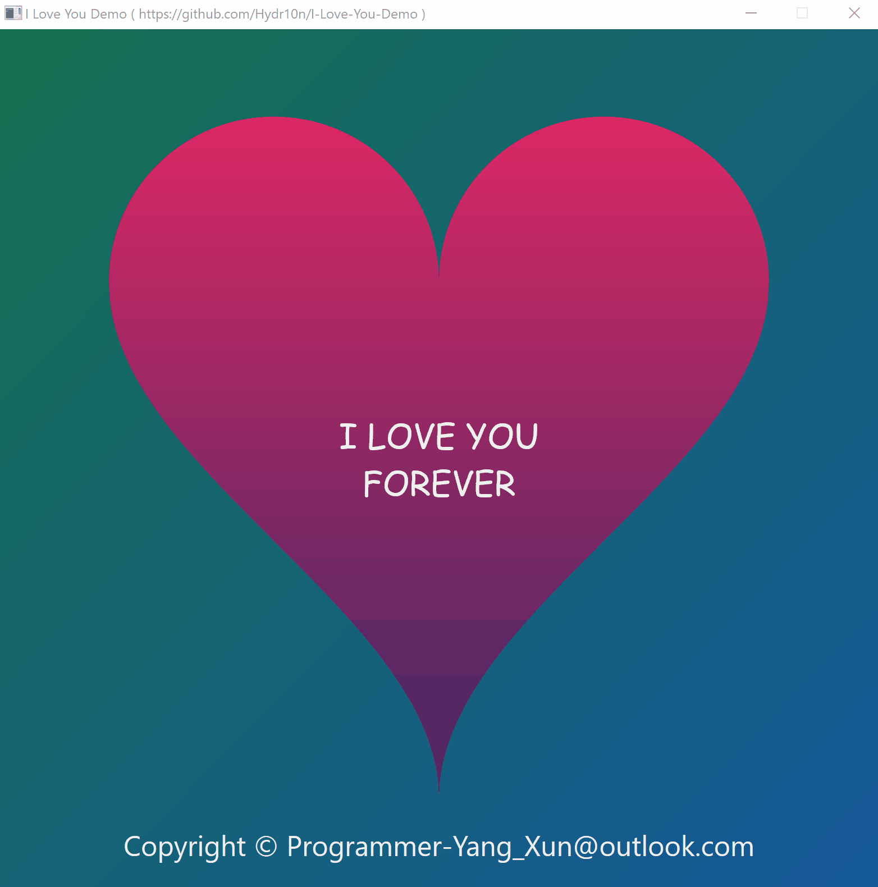

# I-Love-You-Demo

Real-time rendering of a glowing & rotating heart image and texts at solid 60 FPS with GPU using the hardware-accelerated graphics API [Direct2D] and [DirectWrite].

The animations can be controlled in the context menu, and glow & rotation of the heart image can be controlled with mouse.

